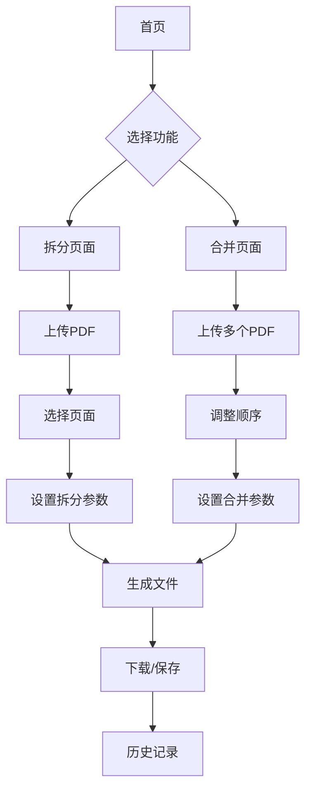

## 1. 产品概述
一个基于网页的PDF文件处理工具，支持用户轻松拆分和合并PDF文件。用户可以选择任意页面进行拆分，跨页提取并合并，以及将多个PDF文件按需组合成新的文件。

目标用户：需要处理PDF文件的办公人员、学生、教师等，解决传统PDF处理软件操作复杂、需要安装的问题，提供简单易用的在线解决方案。

## 2. 核心功能

### 2.1 用户角色
| 角色 | 注册方式 | 核心权限 |
|------|----------|----------|
| 访客用户 | 无需注册 | 可使用所有PDF处理功能，文件临时存储 |
| 注册用户 | 邮箱注册 | 可保存处理历史，云端存储文件 |

### 2.2 功能模块
PDF拆分合并工具包含以下主要页面：
1. **首页**: 功能导航、文件上传区域、操作指引。
2. **拆分页面**: PDF页面预览、页面选择、拆分设置、文件命名。
3. **合并页面**: 多文件上传、页面排序、合并设置、输出配置。
4. **历史记录**: 处理记录查看、文件下载、删除管理。

### 2.3 页面详情
| 页面名称 | 模块名称 | 功能描述 |
|----------|----------|----------|
| 首页 | 功能导航 | 提供拆分和合并两个主要功能的入口按钮 |
| 首页 | 文件上传区域 | 支持拖拽上传PDF文件，显示文件基本信息 |
| 首页 | 操作指引 | 显示简单的使用说明和示例 |
| 拆分页面 | PDF预览器 | 显示PDF所有页面的缩略图，支持页面缩放 |
| 拆分页面 | 页面选择器 | 允许用户选择需要提取的页面，支持多选和跨页选择 |
| 拆分页面 | 拆分设置 | 设置拆分方式（单页、连续页、自定义页码） |
| 拆分页面 | 文件命名 | 为拆分后的文件设置名称，支持批量命名 |
| 拆分页面 | 输出配置 | 选择保存位置和文件格式设置 |
| 合并页面 | 多文件上传 | 支持同时上传多个PDF文件 |
| 合并页面 | 页面排序 | 拖拽调整文件和页面顺序 |
| 合并页面 | 合并预览 | 实时显示合并后的页面顺序和总页数 |
| 合并页面 | 输出设置 | 设置合并后的文件名和保存选项 |
| 历史记录 | 记录列表 | 显示所有处理过的文件记录 |
| 历史记录 | 文件管理 | 支持下载、删除、重新处理等操作 |

## 3. 核心流程

### 访客用户流程
1. 访问首页 → 选择拆分或合并功能
2. 上传PDF文件 → 进行页面选择和设置 → 生成新文件 → 下载结果
3. 文件处理完成后，临时文件会在24小时后自动清理

### 注册用户流程
1. 注册登录 → 进入个人工作台
2. 上传文件处理 → 结果自动保存到个人云空间
3. 可随时查看历史记录和重新下载文件

## 4. 用户界面设计

### 4.1 设计风格
- **主色调**: 蓝色系（#2563eb）作为主色，灰色（#6b7280）作为辅助色
- **按钮样式**: 圆角矩形设计，主要操作为实心按钮，次要操作为边框按钮
- **字体**: 优先使用系统字体，主要文字14-16px，标题18-24px
- **布局风格**: 卡片式布局，左右分栏设计，左侧为操作区，右侧为预览区
- **图标风格**: 使用简洁的线性图标，符合现代Web设计趋势

### 4.2 页面设计概述
| 页面名称 | 模块名称 | UI元素 |
|----------|----------|--------|
| 首页 | 导航区 | 顶部导航栏包含logo、功能按钮、用户登录入口 |
| 首页 | 上传区 | 大文件拖拽区域，支持点击上传，显示上传进度 |
| 拆分页面 | 预览区 | 左侧显示PDF页面缩略图网格，支持滚动加载 |
| 拆分页面 | 操作区 | 右侧显示页面选择状态、拆分选项、文件命名输入框 |
| 合并页面 | 文件列表 | 左侧显示已上传的PDF文件列表，支持拖拽排序 |
| 合并页面 | 预览区 | 右侧显示合并后的页面预览效果 |
| 历史记录 | 记录表格 | 表格形式展示处理记录，包含文件名、时间、大小、操作按钮 |

### 4.3 响应式设计
- **桌面优先**: 主要针对桌面端用户优化，支持1920x1080及以上分辨率
- **移动端适配**: 支持平板和手机访问，采用响应式布局
- **触摸优化**: 移动端支持触摸操作，按钮大小适配手指点击

### 4.4 交互设计
- **拖拽上传**: 支持文件拖拽到指定区域上传
- **实时预览**: 页面选择和合并操作实时显示效果
- **进度提示**: 文件上传和处理过程显示进度条
- **错误处理**: 友好的错误提示和重试机制