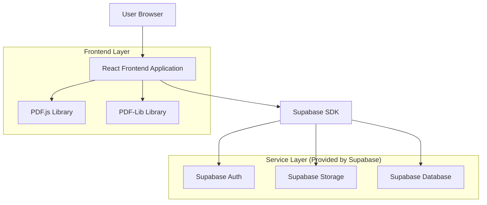
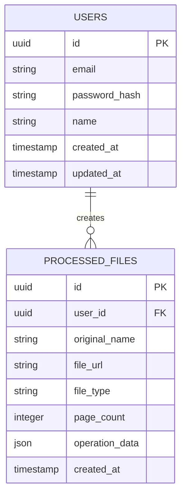

## 1. 架构设计



## 2. 技术描述

- **前端**: React@18 + tailwindcss@3 + vite
- **初始化工具**: vite-init
- **PDF处理**: PDF.js@3 + PDF-Lib@1
- **后端**: Supabase (提供认证、存储、数据库服务)
- **部署**: 支持静态网站托管 (Vercel、Netlify等)

## 3. 路由定义

| 路由 | 用途 |
|-------|---------|
| / | 首页，功能导航和文件上传入口 |
| /split | PDF拆分页面，提供页面选择和拆分功能 |
| /merge | PDF合并页面，支持多文件上传和排序 |
| /history | 历史记录页面，查看和管理处理过的文件 |
| /login | 用户登录页面 |
| /register | 用户注册页面 |
| /profile | 用户个人资料和管理页面 |

## 4. API定义

### 4.1 文件上传API

```
POST /api/upload
```

请求参数 (FormData):
| 参数名 | 参数类型 | 是否必需 | 描述 |
|-----------|-------------|-------------|-------------|
| file | File | 是 | 要上传的PDF文件 |
| userId | string | 否 | 用户ID (注册用户) |

响应:
| 参数名 | 参数类型 | 描述 |
|-----------|-------------|-------------|
| fileId | string | 文件唯一标识符 |
| fileUrl | string | 文件访问URL |
| pages | number | PDF总页数 |

### 4.2 PDF拆分API

```
POST /api/split
```

请求:
| 参数名 | 参数类型 | 是否必需 | 描述 |
|-----------|-------------|-------------|-------------|
| fileId | string | 是 | 原文件ID |
| pages | number[] | 是 | 要提取的页码数组 |
| fileName | string | 是 | 新文件名 |

响应:
| 参数名 | 参数类型 | 描述 |
|-----------|-------------|-------------|
| newFileId | string | 新文件ID |
| downloadUrl | string | 下载链接 |

### 4.3 PDF合并API

```
POST /api/merge
```

请求:
| 参数名 | 参数类型 | 是否必需 | 描述 |
|-----------|-------------|-------------|-------------|
| fileIds | string[] | 是 | 要合并的文件ID数组 |
| fileName | string | 是 | 合并后的文件名 |

响应:
| 参数名 | 参数类型 | 描述 |
|-----------|-------------|-------------|
| newFileId | string | 合并后的文件ID |
| downloadUrl | string | 下载链接 |

## 5. 数据模型

### 5.1 数据模型定义



### 5.2 数据定义语言

用户表 (users)
```sql
-- 创建用户表
CREATE TABLE users (
    id UUID PRIMARY KEY DEFAULT gen_random_uuid(),
    email VARCHAR(255) UNIQUE NOT NULL,
    password_hash VARCHAR(255) NOT NULL,
    name VARCHAR(100) NOT NULL,
    created_at TIMESTAMP WITH TIME ZONE DEFAULT NOW(),
    updated_at TIMESTAMP WITH TIME ZONE DEFAULT NOW()
);

-- 创建索引
CREATE INDEX idx_users_email ON users(email);
```

处理文件记录表 (processed_files)
```sql
-- 创建处理文件记录表
CREATE TABLE processed_files (
    id UUID PRIMARY KEY DEFAULT gen_random_uuid(),
    user_id UUID REFERENCES users(id) ON DELETE CASCADE,
    original_name VARCHAR(255) NOT NULL,
    file_url TEXT NOT NULL,
    file_type VARCHAR(50) NOT NULL,
    page_count INTEGER DEFAULT 0,
    operation_data JSONB DEFAULT '{}',
    created_at TIMESTAMP WITH TIME ZONE DEFAULT NOW()
);

-- 创建索引
CREATE INDEX idx_processed_files_user_id ON processed_files(user_id);
CREATE INDEX idx_processed_files_created_at ON processed_files(created_at DESC);
```

### 5.3 Supabase权限设置

```sql
-- 匿名用户权限 (基本访问)
GRANT SELECT ON processed_files TO anon;
GRANT INSERT ON processed_files TO anon;

-- 认证用户权限 (完全访问)
GRANT ALL PRIVILEGES ON users TO authenticated;
GRANT ALL PRIVILEGES ON processed_files TO authenticated;

-- RLS策略 (行级安全)
ALTER TABLE processed_files ENABLE ROW LEVEL SECURITY;

-- 匿名用户只能查看自己的临时文件
CREATE POLICY "anon_users_can_view_own_files" ON processed_files
    FOR SELECT USING (
        auth.uid() IS NULL AND created_at > NOW() - INTERVAL '24 hours'
    );

-- 认证用户可以管理自己的文件
CREATE POLICY "users_can_manage_own_files" ON processed_files
    FOR ALL USING (auth.uid() = user_id);
```

## 6. 前端组件架构

### 6.1 核心组件

- **PDFViewer**: PDF预览组件，基于PDF.js实现
- **PageSelector**: 页面选择器，支持多选和跨页选择
- **FileUploader**: 文件上传组件，支持拖拽和批量上传
- **ProgressBar**: 进度条组件，显示上传和处理进度
- **DownloadManager**: 下载管理器，处理文件下载和保存

### 6.2 状态管理

使用React Context管理全局状态：
- **UserContext**: 用户认证状态
- **FileContext**: 文件上传和处理状态
- **UIContext**: 界面状态（加载、错误、提示等）

## 7. 性能优化

### 7.1 前端优化
- **懒加载**: PDF页面缩略图按需加载
- **虚拟滚动**: 大量页面时采用虚拟滚动技术
- **缓存策略**: 浏览器端缓存已处理的PDF文件
- **压缩处理**: 客户端PDF处理采用Web Worker避免阻塞主线程

### 7.2 存储优化
- **文件生命周期**: 临时文件24小时自动清理
- **压缩存储**: 上传的PDF文件自动压缩存储
- **CDN加速**: 静态文件使用CDN分发

## 8. 部署配置

### 8.1 环境变量
```
VITE_SUPABASE_URL=your_supabase_url
VITE_SUPABASE_ANON_KEY=your_supabase_anon_key
VITE_MAX_FILE_SIZE=50MB
VITE_MAX_PAGES=1000
```

### 8.2 构建配置
- **Vite配置**: 优化打包体积，启用代码分割
- **PWA支持**: 配置Service Worker支持离线使用
- **SEO优化**: 配置meta标签和sitemap